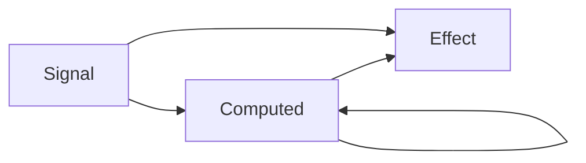
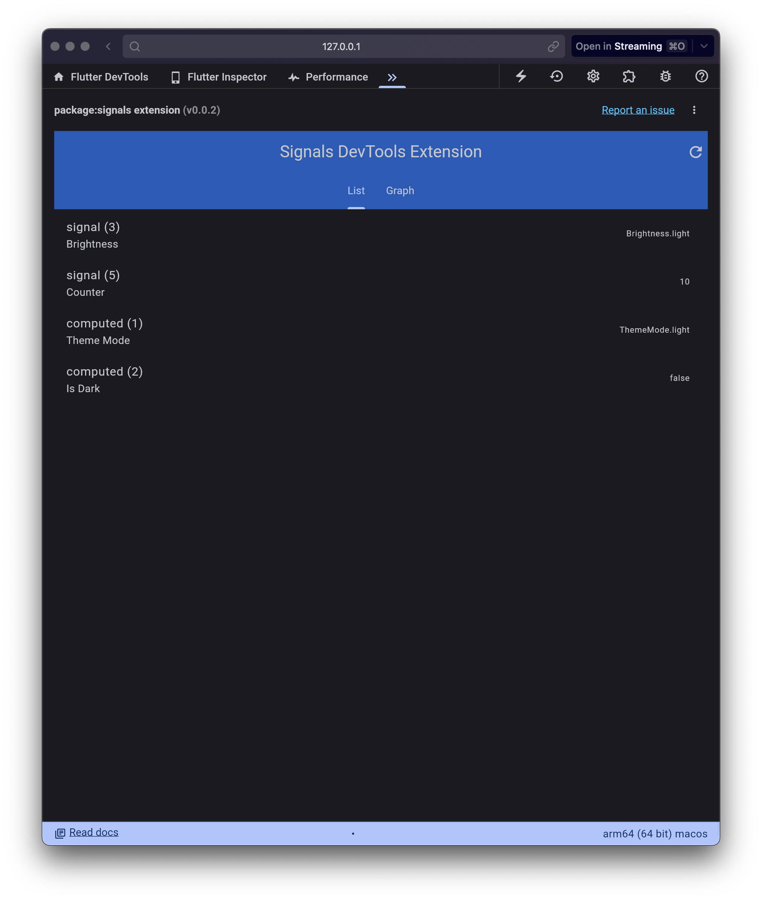

[](https://github.com/rodydavis/signals.dart/actions/workflows/tests.yml)
[](https://github.com/rodydavis/signals.dart/actions/workflows/website.yml)
[](https://github.com/invertase/melos)

# Signals.dart

Complete dart port of [Preact signals](https://preactjs.com/blog/introducing-signals/) and takes full advantage of [signal boosting](https://preactjs.com/blog/signal-boosting/).

Documentation Site: https://rodydavis.github.io/signals.dart/

| Package                                                             | Pub                                                                                                              |
| ------------------------------------------------------------------- | ---------------------------------------------------------------------------------------------------------------- |
| [`signals`](packages/signals)                                       | [](https://pub.dev/packages/signals)                         |
| [`signals_core`](packages/signals_core)                             | [](https://pub.dev/packages/signals_core)          |
| [`signals_flutter`](packages/signals_flutter)                       | [](https://pub.dev/packages/signals_flutter) |
| [`signals_lint`](packages/signals_lint)                             | [](https://pub.dev/packages/signals_lint)          |
| [`signals_devtools_extension`](packages/signals_devtools_extension) |                                                                                                                  |

## Guide / API

The signals library exposes four functions which are the building blocks to model any business logic you can think of.



### `signal(initialValue)`

The `signal` function creates a new signal. A signal is a container for a value that can change over time. You can read a signal's value or subscribe to value updates by accessing its `.value` property.

```dart
import 'package:signals/signals.dart';

final counter = signal(0);

// Read value from signal, logs: 0
print(counter.value);

// Write to a signal
counter.value = 1;
```

Writing to a signal is done by setting its `.value` property. Changing a signal's value synchronously updates every [computed](#computedfn) and [effect](#effectfn) that depends on that signal, ensuring your app state is always consistent.

#### `signal.peek()`

In the rare instance that you have an effect that should write to another signal based on the previous value, but you _don't_ want the effect to be subscribed to that signal, you can read a signals's previous value via `signal.peek()`.

```dart
final counter = signal(0);
final effectCount = signal(0);

effect(() {
	print(counter.value);

	// Whenever this effect is triggered, increase `effectCount`.
	// But we don't want this signal to react to `effectCount`
	effectCount.value = effectCount.peek() + 1;
});
```

Note that you should only use `signal.peek()` if you really need it. Reading a signal's value via `signal.value` is the preferred way in most scenarios.

### `untracked(fn)`

In case when you're receiving a callback that can read some signals, but you don't want to subscribe to them, you can use `untracked` to prevent any subscriptions from happening.

```dart
final counter = signal(0);
final effectCount = signal(0);
final fn = () => effectCount.value + 1;

effect(() {
	print(counter.value);

	// Whenever this effect is triggered, run `fn` that gives new value
	effectCount.value = untracked(fn);
});
```

### `computed(fn)`

Data is often derived from other pieces of existing data. The `computed` function lets you combine the values of multiple signals into a new signal that can be reacted to, or even used by additional computeds. When the signals accessed from within a computed callback change, the computed callback is re-executed and its new return value becomes the computed signal's value.

```dart
import 'package:signals/signals.dart';

final name = signal("Jane");
final surname = signal("Doe");

final fullName = computed(() => name.value + " " + surname.value);

// Logs: "Jane Doe"
print(fullName.value);

// Updates flow through computed, but only if someone
// subscribes to it. More on that later.
name.value = "John";
// Logs: "John Doe"
print(fullName.value);
```

Any signal that is accessed inside the `computed`'s callback function will be automatically subscribed to and tracked as a dependency of the computed signal.

### `effect(fn)`

The `effect` function is the last piece that makes everything reactive. When you access a signal inside an `effect`'s callback function, that signal and every dependency of said signal will be activated and subscribed to. In that regard it is very similar to [`computed(fn)`](#computedfn). By default all updates are lazy, so nothing will update until you access a signal inside `effect`.

```dart
import 'package:signals/signals.dart';

final name = signal("Jane");
final surname = signal("Doe");
final fullName = computed(() => name.value + " " + surname.value);

// Logs: "Jane Doe"
effect(() => print(fullName.value));

// Updating one of its dependencies will automatically trigger
// the effect above, and will print "John Doe" to the console.
name.value = "John";
```

You can destroy an effect and unsubscribe from all signals it was subscribed to, by calling the returned function.

```dart
import 'package:signals/signals.dart';

final name = signal("Jane");
final surname = signal("Doe");
final fullName = computed(() => name.value + " " + surname.value);

// Logs: "Jane Doe"
final dispose = effect(() => print(fullName.value));

// Destroy effect and subscriptions
dispose();

// Update does nothing, because no one is subscribed anymore.
// Even the computed `fullName` signal won't change, because it knows
// that no one listens to it.
surname.value = "Doe 2";
```

#### Warning Cycles

Mutating a signal inside an effect will cause an infinite loop, because the effect will be triggered again. To prevent this, you can use [`untracked(fn)`](#untrackedfn) to read a signal without subscribing to it.

```dart
import 'dart:async';

import 'package:signals/signals.dart';

Future<void> main() async {
  final completer = Completer<void>();
  final age = signal(0);

  effect(() {
    print('You are ${age.value} years old');
    age.value++; // <-- This will throw a cycle error
  });

  await completer.future;
}
```

### `batch(fn)`

The `batch` function allows you to combine multiple signal writes into one single update that is triggered at the end when the callback completes.

```dart
import 'package:signals/signals.dart';

final name = signal("Jane");
final surname = signal("Doe");
final fullName = computed(() => name.value + " " + surname.value);

// Logs: "Jane Doe"
effect(() => print(fullName.value));

// Combines both signal writes into one update. Once the callback
// returns the `effect` will trigger and we'll log "Foo Bar"
batch(() {
	name.value = "Foo";
	surname.value = "Bar";
});
```

When you access a signal that you wrote to earlier inside the callback, or access a computed signal that was invalidated by another signal, we'll only update the necessary dependencies to get the current value for the signal you read from. All other invalidated signals will update at the end of the callback function.

```dart
import 'package:signals/signals.dart';

final counter = signal(0);
final _double = computed(() => counter.value * 2);
final _triple = computed(() => counter.value * 3);

effect(() => print(_double.value, _triple.value));

batch(() {
	counter.value = 1;
	// Logs: 2, despite being inside batch, but `triple`
	// will only update once the callback is complete
	print(_double.value);
});
// Now we reached the end of the batch and call the effect
```

Batches can be nested and updates will be flushed when the outermost batch call completes.

```dart
import 'package:signals/signals.dart';

final counter = signal(0);
effect(() => print(counter.value));

batch(() {
	batch(() {
		// Signal is invalidated, but update is not flushed because
		// we're still inside another batch
		counter.value = 1;
	});

	// Still not updated...
});
// Now the callback completed and we'll trigger the effect.
```

## DevTools



