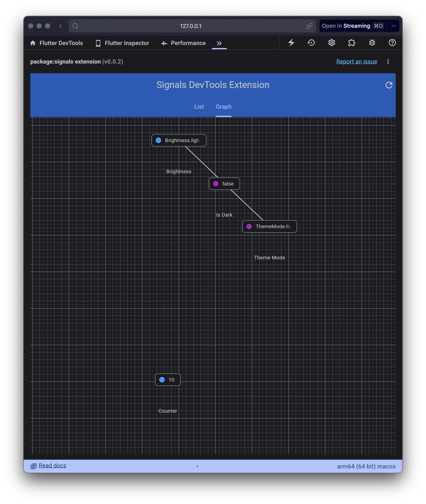

# signals_devtools_extension

https://pub.dev/packages/devtools_extensions

## Running

```bash
flutter run -d chrome --dart-define=use_simulated_environment=true
```

## Build

```bash
flutter pub get &&
dart run devtools_extensions build_and_copy \
    --source=. \
    --dest=../signals/extension/devtools 
```

## Screenshots


